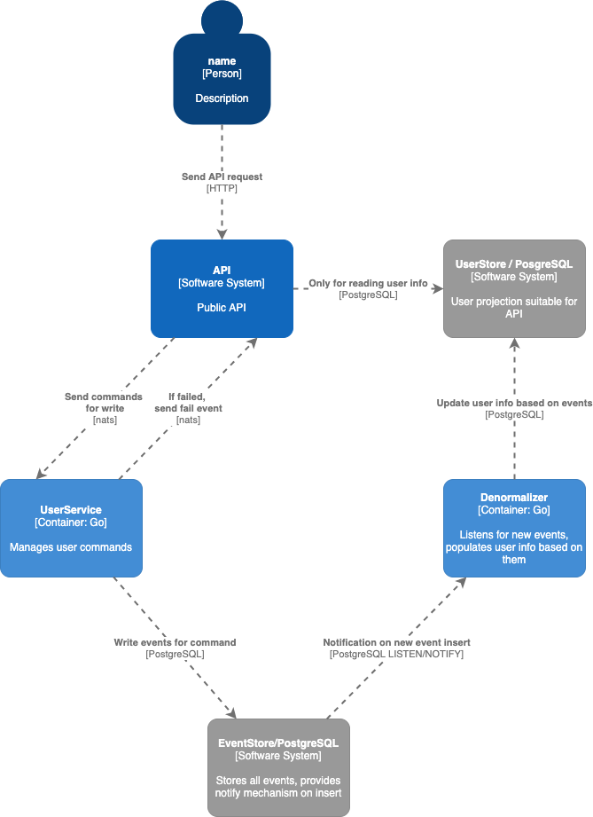

# Documentation

This document attempts to explain how overall design looks like, at last the parts that might not be 
obvious at the first glance. **This document is probably not up to date**.

## Services
There is a couple of services implemented:
- `api` - provides HTTP endpoint for modifying user entity and reading 
  (and only reading) user from database
- `userservice` - responsible for all modifications on user entity. 
  It accepts commands and emits events to the database.
- `denormalizer` - listens for user events generated by user service and applies 
  them to projections of events into user single user entity suitable for returning
  it directly to API customers.
- `stats` - just a POC of service listening for all events and calculating 
  statistics, like number of commands, number of successes and failures, etc.

3rd party services used are:
- PostgreSQL - event store and user entity projection. These two tables are in same
  database, but are completely independent and could be separated easily. It provides
  notifications by utilising PostgreSQL LISTEN/NOTIFY mechanism every time new event
  is inserted to `events` table. `denormalizer` listens for these events and updates
  user entity when new event is inserted.
- nats - used for sending commands from `api` to `userservice` and publishing results
  back. 
  
## Libraries
While all in the same repo, two libraries are extracted:
- `cqrs` - contains entities useful for cqrs and event sourcing implementation, like
  `Command` and `Event`, ways to marshal and unmarshal them, interfaces and default
  implementations for aggregate root, event store, repository and command handlers. 
- `users` - contains commands and events specific for users, shared among `userservice`
  and other services interested in user events and commands. E.g. `api` sends command, 
  so it is useful to have access to the same structure that server is expecting (however,
  it does not have to use it directly, since client is implemented). Also, `denormalizer`
  operates on user events, so sharing these structures is useful.

## Command execution flow
Only services that exposes interface to be consumed by end-user is `api`. 
For reading, it reads directly from its own database (populated by `denormalizer`, so `api`
only needs read access).

For writing, after receiving a request and performing basic validation, it constructs a 
command and sends it to `userservice` (it does so by using user client in `users` package).
Nats is used and for sending commands request/response pattern is used. However, `userservice`
just accepts the command and does not try to execute it right away. It only unmarshals it to
verify if structure is valid, and it is known command and returns response. 

Before sending a command, `api` subscribes to events on nats on topic with subject
that contains `correlation_id`. This `correlation_id` is included in command as well and
serves to tie all activity related to the same command execution. So, if `userservice` fails
to process command, it publishes event on `events.<correlation_id>.error` and `userservice`
knows processing failed. 

However, if `userservice` is successful, it stores events to database. This triggers 
`denormalizer`, which processes events and updates `users` table. If successful, it
publishes event on `events.<correlation_id>.success`, which lets `userservices` know
that processing is successful. 

One command is send, `userservice` waits for feedback on mentioned topics (or up to 
defined timeout). If it got success feedback, it reads user information from `users`
table (updated by this point) and sends HTTP response to the user. 

## Validation
Validation is done in multiple steps. 
- `api` validates HTTP requests (e.g. required field is empty)
- `cqrs.Command` has `Validate` as part of its interface and some commands in `users`
  implement it to validate if command is valid (e.g. when creating user, ID should not
  be sent, since it will be generated, password should be hashed, etc). 
- Default `CommandHandler` offers hook for adding validation function to be executed
  during command handler. This is useful if service wants to do more complex validation. 
  It is used to validate that email is not already taken when user is registering or
  changing email (`userservice` maintains in-memory list of taken emails, constructed
  from past events on start).
